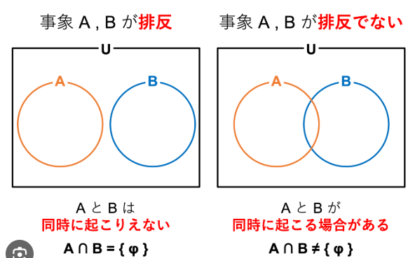
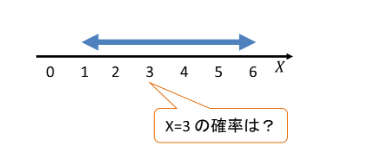
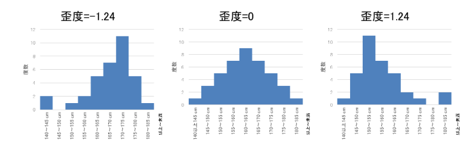
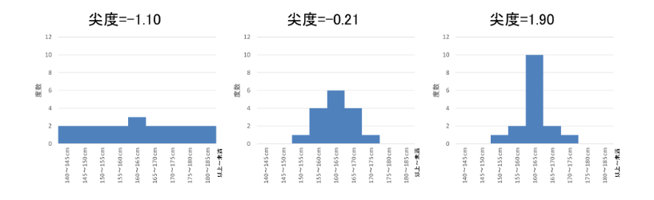
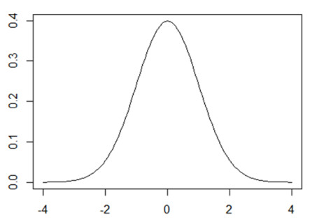

## 0. Follow up
  標準偏差（不偏分散の正の平方根） 
  フィッシャー 
  排反とは 
  組み合わせ計算 
  共分散の計算 
  確率変数に関する計算 
  中心極限定理 
  母比率計算 
  ｔ検定 
  重回帰分析全般（ｔ値、ｐ値、Ｒ２、Ｒ２（修正済み）、有意性など） 

## 1. データの記述と要約
## 2. 確率と確率分布
  |名前|数式または記号|説明|関連|
  |:--:|:--|:--|:--|
  |試行||||
  |根元事象||試行によって起こりうる個々の結果 素事象、標本点ともいう||
  |全事象|$\Omega$|すべての根元事象の集合、標本空間ともいう||
  |和事象|$A_1 \cup A_2$|少なくとも$A_1$もしくは$A_2$の１つが起こる||
  |積事象|$A_1 \cap A_2$|$A_1$と$A_2$が同に起こる||
  |空事象|∅|何も起こらない事象||
  |確率の公理||1. 事象Aに対して$0 \leqq P(A) \leqq 1$を取る 2. $P(\Omega) = 1$ 3. $A_1$, $A_2$,,,が互いに排反ならば $P(A_1 \cup A_2 \cup ,,,) = P(A_1) + P(A_2) + ,,,$となる コルモゴロフの公理ともいう||
  |独立性|$P(B \| A) = P(B)$, $P(A \| B) = P(A)$ $P(A \cap B) = P(A)P(B)$|一方の事象が起こるかどうかが他方の事象の 起こる確率に影響しないこと 二つの確率がある場合でお互いの 結果が互いに影響しない場合は **互いに独立**という||
  |排反||2つの事象AとBが同時に起こらない場合、つまり排反事象の場合の確率||
  |一般的な確率|$P(A) = \frac{A}{\Omega}$|Aは起こった事象の数 $\Omega$は全事象 古典的な定義でありラプラス の定義ともいう||
  |期待値|$E(x) = \sum_{k=1}^{n}p_k x_x$|pは確率 xは取りうる値 1回の試行で得られる値の平均値のことで||
  |加法定理 1|$P(A \cup B) = \frac{(A) + (B)}{\Omega}$|$A \cap B =$ ∅の場合|
  |加法定理 2|$P(A \cup B) = (A) + (B) - P(A \cap B)$|$A \cap B \neq$ ∅の場合|
  |条件付き確率|$P(B\|A) = \frac{P(A \cap B)}{P(A)}$ $P(A \cap B) = P(B\|A)P(A)$|Aという条件下でBが起こる確率|乗法定理|
  |乗法定理|$P(A \cap B) = P(B\|A)P(A)$||条件付き確率|
  |ベイズの定理|$P(H_i\|A) = \frac{P(H_i \cap A)}{P(A)}$ $P(H_i \| A) = \frac{P(H_i)P(A\|H_i)}{P(A)}$|原因から結果を探る手法 P(A)は事前確率 $P(H_i\|A)$は事後確率||
  |離散型確率分布|||一様分布 二項分布 多項分布 ポアソン分布 幾何分布 超幾何分布|
  |確率変数||変数Xのことである確率に対して取り得る値||
  |確率関数||$f(x_i)$と表わされる 離散型の場合は$0 \leq f(x_i) \leq 1$となり 連続型の場合は$\sum_{i=1}^{\infty}f(x_i) = 1$となる||
  |確率質量関数|$f(x) = P(X=x)$ $\sum_{i=1}^{n}P(X=x_i) = 1$|すべてを足し合わせると１になる||
  |連続型確率分布|$P(X=x) = \frac{1}{\infty}$|取りうる値に切れ目がないため、無限となる |連続一様分布 正規分布 指数分 t分布 F分布 カイ二乗分布|
  |確率密度関数|$P(a \leq X \leq b) = \int_{a}^{b} f(x) dx$|算出される値は面積を表していて、その値が確率となる また、**1を超えることがある** 連続型確率変数ともいう||
  |累積分布関数|離散型 $ F(x) = P(X \leq x) = \sum_{X \leq x}P(X)$
連続型 $F(x) = P(X \le1 x) = \int_{- \infty}^{x}f(t)dt$|「確率変数がある値以下（）の値となる確率」を表す関数||
  |期待値|離散型 $E[X] = \sum_i x_if(x_i) = \mu$
連続型 $\int_{-\infty}^{\infty}x(fx)dx = \mu$|平均と同じ意味||
  |分散|離散型 $V[X] = E[(X-\mu)^2]$ $= \sum_i(x_i - \mu)^2f(x_i)$ $= \sigma^2$
連続型 $V[X] = E[(X-\mu)^2]$ $= \int_{-\infty}^{\infty}(x-\mu)^2f(x)dx$ $= \mu^2$
また。。。 $V[X] = E[X^2] - \mu^2$ としても定義される|バラつきを表す指標となり標準偏差（$\sigma$）の2乗||
  |モーメント|歪度（わいど） $\frac{n}{(n-1)(n-2)} \sum_{i=1}^{n}(\frac{x_i-\bar{x}}{s})^3$  尖度（せんど）
$\frac{n(n+1)}{(n-1)(n-2)(n-3)}\sum_{i=1}^{n}\frac{(x_i-\bar{x})^4}{s^4}-\frac{3(n-1)^2}{(n-2)(n-3)}$|歪度と尖度で表される
歪度（わいど） 分布が正規分布からどれだけ歪んでいるかを表す統計量で、 左右対称性を示す指標のことです。サンプルサイズをn、 各データの平均値を、標準偏差をsとすると歪度は次の式から求めらる 
尖度（せんど） 分布が正規分布からどれだけ尖っているかを表す統計量で、 山の尖り度と裾の広がり度を示します。サンプルサイズをn、 各データの平均値を、標準偏差をsとすると尖度は次の式から求められます。 ||
  |ベルヌーイ分布|$P(X=1) \equiv f(1) = p$ $P(X=0) \equiv f(0) = 1-p$

期待値 $\mu = E[X] $ $= 1 \times p + 0 \times (1-p) = p$

分散 $\sigma^2 = E[X^2] - \mu^2$ $= 1^2 \times p + 0^2 \times (1-p) - \mu^2$ $= p(1-p)$|ある確率に応じた１か０かの二つの値をとる $0 \leq p \leq 1$の範囲となる||
  |二項分布|$ P(X=x) = f(x) \\ =  _nC_xp^x(1-p)^{n-x}$

期待値 $E[X]=np \\ = \sum_{x=0}^{n}x \frac{n!}{x!(n-x)!} p^x(1-p)^{n-x}$

分散 $V[X] = np(1-p) \\ =E[X(X-1)]+E[X]-(E[X])^2 \\ = n(n-1)p^2+np-(np)^2$|成功率$p$の$n$回ベルヌーイ試行を行ったとき、 成功回数が$x$となる確率
$B(n,p)$と記すこともある||
  |ポアソン分布|$f(x) = \frac{e^{-\lambda}\lambda^{x}}{x!}$

期待値 $E[X] = \lambda$

分散 $V[E] = \lambda$|$Po(\lambda)$ ここで$np$を一定の値「$\lambda$（ラムダ）」とおき、 $np = \lambda$のままで$n$を十分大きく$p$を十分に 小さくした場合の二項分布は、平均 \lambda$の ポアソン分布に近似することができます。 「ある期間に平均$\lambda$ 回起こる現象が、 ある期間に$X$回起きる確率の分布」||
  |幾何分布|$P(X=k) = (1-p)^{k-q}p$ ($k$ = 1,2,3,...)

期待値 $E(X) = \frac{1}{p}$
分散 $V(X) = \frac{1-p}{p^2}$|成功確率が$p$である独立なベルヌーイ試行を 繰り返す時、初めて成功するまでの試行回数$X$が 従う分布である。 幾何分布の無記憶性、ある事象が発生する確率は、 その事象がはっせいする前の情報の影響を受けない||
  |超幾何分布|$ P(X=k) = \frac{_{N}{C}_{k} \times _{N-M}{C}_{n-k}}{_{N}C_n} $
k以下の条件を満たす $\max (0, n-(N-M)) \leq k \leq \min (n, M)$
期待値 $E(X) = np \space \frac{M}{N}$
分散 $V(X) = n . \frac{M(N-M)}{N^2} . \frac{N-n}{N-1}$|AとBで構成される$N$個からなる集団があり、Aが$M$個、 Bが$N-M$個であるとします。この集団から取り出された $n$個の中に含まれるAの個数が従う確率分布||
  |負の二項分布|1. $P(X=x) =_{k+x-1}C_{x}p^{k}(1-p)^{x}$ $(k = 1,2,3,...)$
期待値 $E(X) = k \frac{1-p}{p}$ 分散 $V(X) = k \frac{1-p}{p^2}$

2. $P(X=x) = _{x-1}C_{k-1} p^{k}(1-p)^{x-k}$ $(k = 1,2,3,...)$ 期待値 $E(X) = \frac{k}{p}$ 分散 $V(X) = k \frac{1-p}{p^2}$|1. 成功率が$p$である独立なベルヌーイ試行を繰り返す時、 **$k$回成功するまでの失敗回数$X$が従う分布**

2. 成功率が$p$である独立なベルヌーイ試行を繰り返す時、 **$k$回成功するまでの試行回数$X$が従う分布**||
  |正規分布|$f(x) = \frac{1}{\sqrt{2 \pi \sigma }}e^ {-\frac{(x - \mu)^2}{2 \sigma^2}}$ $(-\infty \lt x \lt \infty)$
もしくは
$f(x) = \frac{1}{\sqrt{2 \pi \sigma }}\exp(-\frac{(x - \mu)^2}{2 \sigma^2})$ $(-\infty \lt x \lt \infty)$
期待値 $E(X) = \mu$
分散 $V(X) = \sigma^2$|統計学における検定や推定、モデルの作成など様々な 場面で活用される連続型確率分布 横軸を確率変数を、縦軸はそのときの確率密度を表す
 **平均$\mu$、分散$\sigma^2$に従う正規分布**といい、**$X \text{～} N(\mu,\sigma^2)$**
**再生性** 正規分布$N(\mu_1,\sigma_{1}^{2})$に従うあるデータと、そのデータとは 独立な別の正規分布$N(\mu_2, \sigma_{2}^{2})$に従うデータを足したデータは 、正規分布$N(\mu_{1} + \mu_{2}, \sigma_{1}^{2}+\sigma_{2}^{2})$に従う
標準正規分布への変換 正規分布の中で「平均$\mu = 0$、分散$\sigma^2 = 1$」である正規分布を **標準正規分布**という、標準正規分布は$X～N(0,1)$と書く||
  |標準正規分布|標準化とは $z = \frac{X - \mu}{\sigma}$

確率密度関数の算出 $F(x) = P(-\infty \leq X \leq x)$ $=\int_{- \infty}^{x}f(t)dt$
$f(t)$とは $f(t) = \frac{1}{\sqrt{2\pi}}\exp(-\frac{t^2}{2})$|ある確率変数$X$が平均$\mu$、分散$\sigma^2$の**正規分布に従うとき**、 その確率変数$X$を標準化($z$化した平均$\mu = 0$、分散$\sigma^2 = 1$に 従う標準正規分布となる)することにより、**異なるデータ同市を 単純に比較できる。**
また、累積分布関数$F(x)$は確率密度関数$f(t)$を用いて算出できる。 ただし、毎回算出するのは面倒であるた、通常は**標準正規分布表** から数値を参照する。||
  |指数分布|$f(x) =	\begin{cases} \lambda e^{-\lambda x} \space \space x \geqq 0 \\ 0 \space \space \space \space \space \space \space \space \space \space x \lt 0 \end{cases}$

期待値: $E(X) = \frac{1}{\lambda}$

分散 $V(X) = \frac{1}{\lambda^2}$

$f(t) = \lambda e^{-\lambda t}$は確率密度関数, 特定の値の濃さ（密度）を連続分布としても使用

累積分布関数 $P(T \leq t) = 1-e^{-\lambda t}$

生存関数 $P(T \geq t)=e^{-\lambda t}$|ある事象が発生してから次に起こるまでの期間が従う分布
$\lambda =$**ある期間に事象が起こる回数**
$X = x$（確率密度関数）
**※必ず正の値を取る**

累積分布関数 $t$以下になる確率を求める時に使用

生存関数 $t$より大きい、まだ*"起こらない"*確率||
  |||||
  |||||
  |||||
  |||||
  |||||
  |||||
## 3. 統計的推定
  |名前|数式または記号|説明|関連|
  |:--|:--|:--|:--|
  |Z分布 (標準正規分布)||定義: 母集団の平均$\mu$と標準偏差$\sigma$が既知のとき 、正規分布に従う母集団から抽出された標本平均 $\bar{x}$を標準化した値$Z = \frac{\bar{x} - \mu}{\sigma/\sqrt{n}}$が従う分布  特徴: 平均0、分散1の正規分布であり、その形状は 左右対称な釣鐘型である  使い分け:母平均の検定: 母分散が既知の場合に、 標本平均が特定の母平均と異なるかどうかを検定 する際に用いる  大標本の場合: 母分散が未知であっても、標本サイズ$n$が 十分に大きい（一般的に30以上）場合、中心極限定理 により標本分散を母分散の代わりに使用してもZ分布で 近似できる。|母平均の検定・推定 母分散が既知、もしくはサンプルサイズが十分大きいときに適用|
  |t分布||定義: 母分散が未知の正規母集団から抽出された標本平均 を標準化した値$t = \frac{\bar{x} - \mu}{s/\sqrt{n}}$が従う分布で ここで、$s$は不偏標本標準偏差である。  特徴: 自由度df=n−1によって形状が変化します。 自由度が小さいほど裾野が厚く（両端が広がり）、 Z分布よりも分散が大きくなります。自由度が大 きくなるにつれてZ分布に近づきます。  使い分け:母平均の検定: 母分散が未知の場合に、標本平均が特定の母平均と異なるかどうかを検定する際に用います。 小標本の場合: 特に標本サイズが小さい場合に適しています。|母平均の検定・推定 母分散が未知|
  |$χ^{2}$分布 (カイ二乗分布)||定義: 互いに独立で、それぞれが標準正規分布$N(0, 1)$に 従う確率変数$Z_1, Z_2, \dots, Z_k$の 2乗の和$\chi^2 = Z_1^2 + Z_2^2 + \dots + Z_k^2$が従う分布です。  特徴: 自由度kによって形状が変化し、非対称で右に歪んだ分布で 値は常に0以上になります。  使い分け:母分散の検定・区間推定: 母集団の分散が特定の母分散 と異なるかどうかを検定したり、 区間推定を行ったりする際に用います。  適合度の検定: 観測された度数分布が、理論的な分布と一致するか どうかを検定する際に用います。  独立性の検定: 2つのカテゴリカル変数が独立であるかどうかを 検定する際に用います。|母分散 カテゴリカルデータの度数の検定・推定 母分散の検定・推定 適合度の検定、独立性の検定|
  |F分布||定義: 互いに独立で、それぞれ自由度k1,k2の$\chi^2$分布に従う確率変数 W_1, W_2があるとき、$\frac{W_1/k_1}{W_2/k_2}$が従う分布です。 特徴: 2つの自由度（分子の自由度k1と分母の自由度k2）によって 形状が変化し、非対称で右に歪んだ分布です。値は常に0以上になります。  使い分け: 分散の比較: 2つの母集団の分散が等しいかどうかを検定する（等分散性 の検定）際に用います。 分散分析 (ANOVA): 3つ以上のグループの平均値が互いに異なるかどうか を検定する際に用います。 回帰分析: 回帰モデル全体の適合度を評価する際に用います。|分散の比、複数の平均の検定・推定 2つの母分散の比較、分散分析 (ANOVA)|
  |不偏分散|$\hat{\sigma^2} = \frac{1}{n-1}\sum_{i=1}^{n}(x_i-\bar{x})2$|分散の不偏推定量で標本から算出される、分散値である。 $n-1$とすることで実際の分散に近くなる性質がある||
  |||||
  |||||
  |||||
## 4. 統計的仮説検定
## 5. 線形モデル分析
## 6. その他の分析法