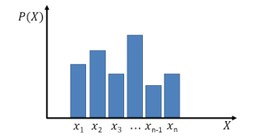
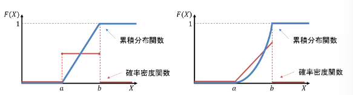
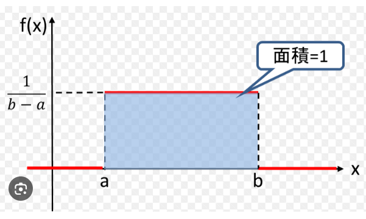

## 0. Follow up
  組み合わせ計算 
  共分散の計算 
  確率変数に関する計算 
  母比率計算 
  ｔ検定 
  重回帰分析全般（ｔ値、ｐ値、Ｒ２、Ｒ２（修正済み）、有意性など） 
  χ二乗検定 
  標本比率 
  抽出方法 

## 1. データの記述と要約
  |名前|数式または記号|説明|関連|
  |:--:|:--|:--|:--|
  |||||
  |||||
  |||||
  |||||
  |相関係数|rxy = Sxy / (Sx × Sy)  Sxy は共分散 Sxy = (1/n) Σ(xi - x̄)(yi - ȳ)  Sxはxの標準偏差 Syはyの標準偏差|データxとyの相関をみることができる  必ず-1 ≤ rxy ≤ 1の値を取る||
  |偽相関||見かけ上の相関、関係性がないのに相関があるように見えること||
  |偏相関係数|r(yz.x) = (ryz - rxy × rxz) / (√(1 - rxy²) × √(1 - rxz²))|偽相関を見抜く方法  データx、y、zがあったときにxによる相関の影響を除く||
  |独立性と無相関||独立性なら無相関という関係は成り立つが、無相関なら独立という関係は成り立たない  例として、無相関であるプロットを見たときに明らかに独立でないケース（関係性がある）  以下の例だと、相関係数が0.04だけど、明らかに独立ではない ||
  |||||
  |||||
  |ラスパイレス指数|PL = (Σ pit × q0i) / (Σ p0i × q0i) × 100  p0i：基準年の価格 q0i：基準年の数量 pti：比較年の価格 qti：比較年の数量|基準年の購入量や取引量を重みとして算出する価格指数  基準年の値を基準として計算して比較する  基準年と比べてどれだけ、変化したかを表す||
  |パーシェ指数|PP = (Σ pit × qti) / (Σ p0i × qti) × 100  p0i：基準年の価格 q0i：基準年の数量 pti：比較年の価格 qti：比較年の数量|比較年の購入量や取引量を重みとして算出する価格指数  比較年の値を基準として計算して比較する  基準年の価格で同じものを購入した場合の費用を計算||
  |フィッシャー指数|√(PL × PP)|ラスパイレス指数とパーシェ指数の幾何平均によって算出  理想的な指数とされているが計算が複雑||
  |||||
  |||||
  |変化率（時系列データ）|差を使う場合 ある時点の値 - 前時点の値  比を使う ある時点の値 ÷ 前時点の値  変化率 (ある時点の値 - 前時点の値) ÷ 前時点の値|差：どの程度増加・現象したかがわかる  比：前の時点と比較して何倍増加したかわかる  変化率：前の時点に対するある時点の値の増減の度合いがわかる||
  |||||
  |||||
  |||||
  |||||
  |||||
  |||||

## 2. 確率と確率分布
  |名前|数式または記号|説明|関連|
  |:--:|:--|:--|:--|
  |試行||||
  |根元事象||試行によって起こりうる個々の結果 素事象、標本点ともいう||
  |全事象|Ω|すべての根元事象の集合、標本空間ともいう||
  |和事象|A1 ∪ A2|少なくともA1もしくはA2の１つが起こる||
  |積事象|A1 ∩ A2|A1とA2が同時に起こる||
  |空事象|∅|何も起こらない事象||
  |確率の公理||1. 事象Aに対して0 ≤ P(A) ≤ 1を取る 2. P(Ω) = 1 3. A1, A2,...が互いに排反ならば P(A1 ∪ A2 ∪ ...) = P(A1) + P(A2) + ...となる コルモゴロフの公理ともいう||
  |独立性|P(B\|A) = P(B), P(A\|B) = P(A) P(A ∩ B) = P(A)P(B)|一方の事象が起こるかどうかが他方の事象の起こる確率に影響しないこと 二つの確率がある場合でお互いの結果が互いに影響しない場合は**互いに独立**という||
  |排反||2つの事象AとBが同時に起こらない場合、つまり排反事象の場合の確率||
  |一般的な確率|P(A) = A/Ω|Aは起こった事象の数 Ωは全事象 古典的な定義でありラプラスの定義ともいう||
  |期待値|E(x) = Σ pk × xk|pは確率 xは取りうる値 1回の試行で得られる値の平均値のこと||
  |加法定理 1|P(A ∪ B) = P(A) + P(B)|A ∩ B = ∅の場合|
  |加法定理 2|P(A ∪ B) = P(A) + P(B) - P(A ∩ B)|A ∩ B ≠ ∅の場合|
  |条件付き確率|P(B\|A) = P(A ∩ B) / P(A) P(A ∩ B) = P(B\|A) × P(A)|Aという条件下でBが起こる確率|乗法定理|
  |乗法定理|P(A ∩ B) = P(B\|A) × P(A)||条件付き確率|
  |ベイズの定理|P(Hi\|A) = P(Hi ∩ A) / P(A) P(Hi\|A) = P(Hi) × P(A\|Hi) / P(A)|原因から結果を探る手法 P(A)は事前確率 P(Hi\|A)は事後確率||
  |離散型確率分布|||一様分布 二項分布 多項分布 ポアソン分布 幾何分布 超幾何分布|
  |確率変数||変数Xのことである確率に対して取り得る値||
  |確率関数||f(xi)と表わされる 離散型の場合は0 ≤ f(xi) ≤ 1となり 連続型の場合はΣf(xi) = 1となる||
  |確率質量関数|f(x) = P(X=x) Σ P(X=xi) = 1|すべてを足し合わせると１になる||
  |連続型確率分布|P(X=x) = 1/∞|取りうる値に切れ目がないため、無限となる |連続一様分布 正規分布 指数分布 t分布 F分布 カイ二乗分布|
  |確率密度関数|P(a ≤ X ≤ b) = ∫ab f(x) dx|算出される値は面積を表していて、その値が確率となる また、**1を超えることがある** 連続型確率変数ともいう||
  |累積分布関数|離散型 F(x) = P(X ≤ x) = Σ P(X)  連続型 F(x) = P(-∞ ≤ X ≤ x) = ∫-∞x f(t) dt|確率変数Xが**ある値x以下(X ≤ x)の値となる確率**  大文字のFを用いてF(x)と表わす  離散型   連続型   確率密度関数f ← → 累積分布関数Fと表わされる  F(∞) = 1 確率変数がある範囲の値しかとらないときに、Xがとる値がその範囲の最大値以上となる場合に成立する  F(-∞) = 0 確率変数Xがとる値がマイナス無限大となる確率は0である||
  |期待値|離散型 E[X] = Σ xi × f(xi) = μ  連続型 ∫-∞∞ x × f(x) dx = μ|平均と同じ意味||
  |分散|離散型 V[X] = E[(X-μ)²] = Σ(xi - μ)² × f(xi) = σ²  連続型 V[X] = E[(X-μ)²] = ∫-∞∞ (x-μ)² × f(x) dx = σ²  また... V[X] = E[X²] - μ² としても定義される|バラつきを表す指標となり標準偏差（σ）の2乗||
  |モーメント|歪度（わいど） n / ((n-1)(n-2)) × Σ((xi-x̄)/s)³  尖度（せんど） n(n+1) / ((n-1)(n-2)(n-3)) × Σ(xi-x̄)⁴/s⁴ - 3(n-1)² / ((n-2)(n-3))|歪度と尖度で表される  歪度（わいど） 分布が正規分布からどれだけ歪んでいるかを表す統計量で、左右対称性を示す指標のことです。サンプルサイズをn、各データの平均値をx̄、標準偏差をsとすると歪度は次の式から求められる   尖度（せんど） 分布が正規分布からどれだけ尖っているかを表す統計量で、山の尖り度と裾の広がり度を示します。サンプルサイズをn、各データの平均値をx̄、標準偏差をsとすると尖度は次の式から求められます。 ||
  |ベルヌーイ分布|P(X=1) ≡ f(1) = p P(X=0) ≡ f(0) = 1-p  期待値 μ = E[X] = 1 × p + 0 × (1-p) = p  分散 σ² = E[X²] - μ² = 1² × p + 0² × (1-p) - μ² = p(1-p)|ある確率に応じた１か０かの二つの値をとる 0 ≤ p ≤ 1の範囲となる||
  |二項分布|P(X=x) = f(x) = nCx × px × (1-p)n-x  期待値 E[X] = np  分散 V[X] = np(1-p)|成功率pのn回ベルヌーイ試行を行ったとき、成功回数がxとなる確率  B(n,p)と記すこともある||
  |ポアソン分布|f(x) = e-λ × λx / x!  期待値 E[X] = λ  分散 V[X] = λ|Po(λ) ここでnpを一定の値「λ（ラムダ）」とおき、np = λのままでnを十分大きくpを十分に小さくした場合の二項分布は、平均λのポアソン分布に近似することができます。  「ある期間に平均λ回起こる現象が、ある期間にX回起きる確率の分布」||
  |幾何分布|P(X=k) = (1-p)k-1 × p (k = 1,2,3,...)  期待値 E(X) = 1/p  分散 V(X) = (1-p)/p²|成功確率がpである独立なベルヌーイ試行を繰り返す時、初めて成功するまでの試行回数Xが従う分布である。 幾何分布の無記憶性、ある事象が発生する確率は、その事象が発生する前の情報の影響を受けない||
  |超幾何分布|P(X=k) = (MCk × N-MCn-k) / NCn  k以下の条件を満たす max(0, n-(N-M)) ≤ k ≤ min(n, M)  期待値 E(X) = n × M/N  分散 V(X) = n × M(N-M)/N² × (N-n)/(N-1)|AとBで構成されるN個からなる集団があり、AがM個、BがN-M個であるとします。この集団から取り出されたn個の中に含まれるAの個数が従う確率分布||
  |負の二項分布|1. P(X=x) = k+x-1Cx × pk × (1-p)x (k = 1,2,3,...)  期待値 E(X) = k × (1-p)/p  分散 V(X) = k × (1-p)/p²  2. P(X=x) = x-1Ck-1 × pk × (1-p)x-k (k = 1,2,3,...)  期待値 E(X) = k/p  分散 V(X) = k × (1-p)/p²|1. 成功率がpである独立なベルヌーイ試行を繰り返す時、**k回成功するまでの失敗回数Xが従う分布**  2. 成功率がpである独立なベルヌーイ試行を繰り返す時、**k回成功するまでの試行回数Xが従う分布**||
  |正規分布|f(x) = 1/(√(2πσ²)) × e-(x-μ)²/(2σ²) (-∞ < x < ∞)  もしくは f(x) = 1/(√(2πσ²)) × exp(-(x-μ)²/(2σ²)) (-∞ < x < ∞)  期待値 E(X) = μ  分散 V(X) = σ²|統計学における検定や推定、モデルの作成など様々な場面で活用される連続型確率分布 横軸を確率変数を、縦軸はそのときの確率密度を表す    **平均μ、分散σ²に従う正規分布**といい、**X ~ N(μ,σ²)**  **再生性** 正規分布N(μ₁,σ₁²)に従うあるデータと、そのデータとは独立な別の正規分布N(μ₂, σ₂²)に従うデータを足したデータは、正規分布N(μ₁ + μ₂, σ₁²+σ₂²)に従う  標準正規分布への変換 正規分布の中で「平均μ = 0、分散σ² = 1」である正規分布を**標準正規分布**という、標準正規分布はX~N(0,1)と書く||
  |標準正規分布|標準化とは z = (X - μ)/σ  確率密度関数の算出 F(x) = P(-∞ ≤ X ≤ x) = ∫-∞x f(t) dt  f(t)とは f(t) = 1/√(2π) × exp(-t²/2)|ある確率変数Xが平均μ、分散σ²の**正規分布に従うとき**、その確率変数Xを標準化(z化した平均μ = 0、分散σ² = 1に従う標準正規分布となる)することにより、**異なるデータ同士を単純に比較できる。**  また、累積分布関数F(x)は確率密度関数f(t)を用いて算出できる。ただし、毎回算出するのは面倒であるため、通常は**標準正規分布表**から数値を参照する。||
  |指数分布|f(x) = λe-λx (x ≥ 0) f(x) = 0 (x < 0)  期待値: E(X) = 1/λ  分散 V(X) = 1/λ²  f(t) = λe-λtは確率密度関数,特定の値の濃さ（密度）を連続分布としても使用  累積分布関数 P(T ≤ t) = 1-e-λt  生存関数 P(T ≥ t) = e-λt|ある事象が発生してから次に起こるまでの期間が従う分布  λ = **ある期間に事象が起こる回数**  X = x（確率密度関数）  **※必ず正の値を取る**  累積分布関数 t以下になる確率を求める時に使用  生存関数 tより大きい、まだ*"起こらない"*確率||
  |離散一様分布|P(X=k) = 1/N (k=1,2,...,N)  E(X) = (N + 1)/2 V(X) = (N² - 1)/12  別の例として... P(X=k) = 1/(b-a+1) (k=a,a+1,...,b) E(X) = (a+b)/2 V(X) = ((b-a+1)² - 1)/12|すべての事象の起こる確率が等しい分布のこと  ||
  |連続一様分布|f(x) = 1/(b-a) (a ≤ x ≤ b) f(x) = 0 (x < a, x > b) E(X) = (a+b)/2 V(X) = (b-a)²/12|確率変数が**X**がどんな値でも、その時の確率密度関数f(x)が**一定の値をとる分布のこと**  ||
  |||||
  |||||
  |||||
  |２変数の確率、同時確率|離散型 f(xi , yj) = P(X = xi , Y = yj) (i = 1,2,..., j = 1,2,...) ΣΣ f(xi, yj) = 1 この時の fx(xi) = Σ f(xi, yj) = P(X = xi) (i = 1,2,...) fy(yj) = Σ f(xi, yj) = P(Y = yj) (j = 1,2,...) をfx(xi)とfy(yj)をそれぞれXとYの周辺確率関数という  連続型 P(a ≤ X ≤ b, c ≤ Y ≤ d) = ∫ab ∫cd f(x, y) dxdy を同時確率密度関数という  ∫-∞∞ ∫-∞∞ f(x, y) dxdy = 1 となる 周辺確率密度関数は fx(x) = ∫-∞∞ f(x,y)dy fy(y) = ∫-∞∞ f(x,y)dx となる  期待値 E(X + Y) = E(X) + E(Y) E(X - Y) = E(X) - E(Y) となり、独立である場合は E(XY) = E(X)E(Y) となる  分散 V(X + Y) = V(X) + V(Y) + 2Cov(X,Y) V(X - Y) = V(X) + V(Y) - 2Cov(X,Y) となり、共分散Cov(X,Y)が０、すなわちXとYが独立である場合には V(X + Y) = V(X) + V(Y) V(X - Y) = V(X) +V(Y)が成り立つ  ２つの確率変数の共分散 Cov(X, Y) = E[(X - μx)(Y - μy)]  相関係数は ρ = Cov(X, Y) / √(V(X)V(Y))|||
  |||||
  |チェビシェフの不等式|P(\|X-μ\| ≥ kσ ) ≤ 1/k²|確率変数Xが、平均μ、分散σ²の確率分布に従うとき、成り立つ不等式  **kは任意の値で、どんな確率分布の確率変数Xでも成り立つ**||
  |||||
  |||||
  |||||
  |||||
## 3. 統計的推定
  |名前|数式または記号|説明|関連|
  |:--|:--|:--|:--|
  |||||
  |||||
  |||||
  |||||
  |フィッシャーの3原則||・反復 それぞれの処理に対して2回以上の繰り返し実験（評価）を行う 反復実験を行って偶然誤差のばらつきが分かれば真の平均のとりうる範囲の測定   ・無作為化 実験の順序や場所などが複数ある場合に、比較したい処理群を無作為（ランダム）に割り付けることで、影響の偏りを小さくする。系統誤差を偶然誤差に取り込むことができる   ・局所管理 実験を行う時間や場所をブロックごとに区切って、そのブロック内でのバックグラウンドができるだけ均一になるように管理する系統誤差を小さくする ||
  |乱塊法||**反復**と**無作為**化に加えて**局所管理**も盛り込んだ実験デザイン 基本は局所管理に基づいたブロック内での1セットで実験を集めて無作為化を行う ||
  |中心極限定理||ある母集団からn個の標本をとったとき、nを大きくすれば標本の平均値は母平均μ、σ²/n（母分散を標本で割った数）の正規分布に従う||
  |大数の法則||ある集団からn個の標本をとったとき、nを大きくすれば標本の平均値はX̄nは、母平均μに近づいていく||
  |記述統計学と推測統計学||記述統計学：データを整理し、表やグラフで表す  推測統計学：母集団の標本を使って、母集団の情報を推測する||
  |点推定|x̄ = (1/n) × Σxi|平均値などを１つの値で推定すること  μ̂を推定値という||
  |一致性||推定量を元に母平均や母分散を推測するときに、大数の法則によってサンプルサイズnが大きくなると標本平均が母平均に近づくという性質||
  |不偏性||推定量が母集団パラメータの真の値を平均的に正しく推定する性質||
  |不偏推定量||標本から計算された推定量の期待値が、母集団の真の値と等しくなるような推定量||
  |標本分散|S² = (1/n) × Σ(xi - x̄)²|標本から得られた平均x̄からサンプルサイズnとして求められる  ただし、標本分散は一致推定量ではあるものの不偏推定量でないため、nが大きくないと標本分散の期待値は母分散に一致せず、母分散よりも小さくなる||
  |不偏分散|S² = (1/(n-1)) × Σ(xi - x̄)²|標本分散にかわり、標本分散の期待値が母分散に一致するように標本分散の算出式にn/(n-1)をかけたものが不偏分散の算出式となります。 したがって、不偏分散は一致性と不偏性をもつ推定量です。||
  |標準偏差|S = √((1/(n-1)) × Σ(xi - x̄)²)|分散の正の平方根で定義される||
  |標準誤差|SE = s/√n = √((1/(n-1)) × Σ(xi - x̄)²) / √n|標準誤差（SE：standard error）は推定量の標準偏差  推定量のバラつきそのものを表す  一般的に標本平均の標準偏差を意味する  中心極限定理の性質からnが大きくなるにつれて正規分布に近づく  標本平均の値が母平均に対してどの程度ばらついているかを表す||
  |標準正規分布(z分布)|標準化((x̄ - μ)/√(σ²/n))|x̄は標本平均  標準化した値が標準正規分布の信頼区間の範囲にあるか確認する  以下、信頼区間95％の例   母分散既知の時の母平均の信頼区間を求めるときに使用される||
  |信頼区間の意味||母集団から標本を取ってきて、その平均から95%信頼区間を求める、という作業を100回やったときに、95回はその区間の中に母平均が含まれる    信頼係数(90％、95％、99％など)が大きいほど、信頼区間の幅は広くなる  標本平均が同じであると仮定したときにサンプルサイズnが大きいほど、信頼区間の幅は狭くなる||
  |t分布||||
  |||||
  |||||
## 4. 統計的仮説検定
  |名前|数式または記号|説明|関連|
  |:--|:--|:--|:--|
  |||||
  |||||
  |||||
  |||||
  |Z分布 (標準正規分布)||定義: 母集団の平均μと標準偏差σが既知のとき、正規分布に従う母集団から抽出された標本平均x̄を標準化した値Z = (x̄ - μ)/√(σ²/n)が従う分布  特徴: 平均0、分散1の正規分布であり、その形状は左右対称な釣鐘型である  使い分け:母平均の検定: 母分散が既知の場合に、標本平均が特定の母平均と異なるかどうかを検定する際に用いる  大標本の場合: 母分散が未知であっても、標本サイズnが十分に大きい（一般的に30以上）場合、中心極限定理により標本分散を母分散の代わりに使用してもZ分布で近似できる。|母平均の検定・推定 母分散が既知、もしくはサンプルサイズが十分大きいときに適用|
  |t分布||定義: 母分散が未知の正規母集団から抽出された標本平均を標準化した値t = (x̄ - μ)/(s/√n)が従う分布で、ここで、sは不偏標本標準偏差である。  特徴: 自由度df=n−1によって形状が変化します。自由度が小さいほど裾野が厚く（両端が広がり）、Z分布よりも分散が大きくなります。自由度が大きくなるにつれてZ分布に近づきます。  使い分け:母平均の検定: 母分散が未知の場合に、標本平均が特定の母平均と異なるかどうかを検定する際に用います。 小標本の場合: 特に標本サイズが小さい場合に適しています。|母平均の検定・推定 母分散が未知|
  |χ² 分布 (カイ二乗分布)||定義: 互いに独立で、それぞれが標準正規分布N(0, 1)に従う確率変数Z₁, Z₂, ..., Zkの2乗の和χ² = Z₁² + Z₂² + ... + Zk²が従う分布です。  特徴: 自由度kによって形状が変化し、非対称で右に歪んだ分布で値は常に0以上になります。  使い分け:母分散の検定・区間推定: 母集団の分散が特定の母分散と異なるかどうかを検定したり、区間推定を行ったりする際に用います。  適合度の検定: 観測された度数分布が、理論的な分布と一致するかどうかを検定する際に用います。  独立性の検定: 2つのカテゴリカル変数が独立であるかどうかを検定する際に用います。|母分散 カテゴリカルデータの度数の検定・推定 母分散の検定・推定 適合度の検定、独立性の検定|
  |F分布||定義: 互いに独立で、それぞれ自由度k₁,k₂のχ²分布に従う確率変数W₁, W₂があるとき、(W₁/k₁)/(W₂/k₂)が従う分布です。 特徴: 2つの自由度（分子の自由度k₁と分母の自由度k₂）によって形状が変化し、非対称で右に歪んだ分布です。値は常に0以上になります。  使い分け: 分散の比較: 2つの母集団の分散が等しいかどうかを検定する（等分散性の検定）際に用います。 分散分析 (ANOVA): 3つ以上のグループの平均値が互いに異なるかどうかを検定する際に用います。 回帰分析: 回帰モデル全体の適合度を評価する際に用います。|分散の比 複数の平均の検定・推定 2つの母分散の比較 分散分析 (ANOVA)|
  |||||
  |||||
  |P値||||
  |||||
  |||||
  |||||
  |||||
## 5. 線形モデル分析
  |名前|数式または記号|説明|関連|
  |:--|:--|:--|:--|
  |単回帰分析|y = β₀ + β₁x β₀は切片 β₁は傾き|目的変数yについて説明変数xを使った式 **回帰方程式**や**回帰式**ともいう  説明変数が1つなので単回帰となる  β₀とβ₁を求めると回帰式がわかる  β₀とβ₁を求めるには最小二乗法を使用する||
  |最小二乗法|Σei² = Σ[yi - (β̂₀ + β̂₁xi)]²  β₀とβ₁の求め方 β₀とβ₁をそれぞれ微分する Σei² = Σ[yi - (β̂₀ + β̂₁xi)]² から β̂₁ = Σ(yi - ȳ)(xi - x̄) / Σ(xi - x̄)² から β̂₀ = ȳ - β̂₁x̄|β₀は切片でβ₁は回帰係数  性質として、 (y - ȳ) = β₁(x - x̄) となる||
  |平方和の分解|Σ(yi - ȳ)² = Σ(ŷi - ȳ)² + Σ(yi - ŷi)² は Sy(=Sr) = SR + Se となる|Sy：応答変数yの変動の大きさを表す  SR：回帰による平方和  Se：残差平方和||
  |決定係数|R² = SR / Sy  (0 ≤ R² ≤ 1)|寄与率とも呼ばれ、算出された回帰式の当てはまりの良さを示す||
  |重相関係数|R = Syŷ / (Sy × Sŷ)|実測値yと予測値ŷとの相関係数  Rと表わされ、二乗すると決定係数R²と等しくなる||
  |重回帰分析|y = β₀ + β₁x₁ + β₂x₂ + ... + βnxn|β₀は切片で  β₁x₁ + β₂x₂ + ... + βnxnは偏回帰係数||
  |標準化偏回帰係数||説明変数及び目的変数をそれぞれ標準化した値から算出される偏回帰係数。  各変数の標準化偏回帰係数どうしを同じ単位で比較できる||
  |偏回帰係数の有意性の検定|ti = (β̂i - 0) / se(β̂i)|seは標準誤差  定数項を含めた各偏回帰係数β̂iが0であるかの検定  帰無仮説は偏回帰係数＝0として、偏回帰係数β̂iを標準誤差で割った値について、自由度（n - k -1）のt分布を用いて検定する。||
  |自由度調整済み決定係数|Rf² = 1 - [Σ(yi - ŷi)²/(n-k-1)] / [Σ(yi - ȳ)²/(n-1)]|重回帰分析で変数の数が増えていくごとに決定係数の値が良くなるという性質を防ぐための方法||
  |||||
  |||||
  |||||
  |||||
  |||||
  |||||
  |||||
  |||||
  |||||
## 6. その他の分析法